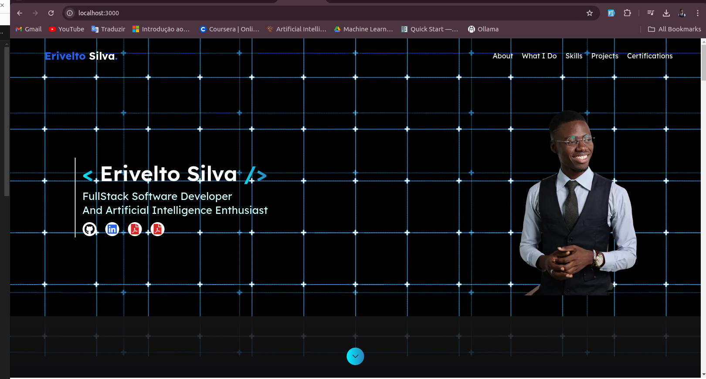
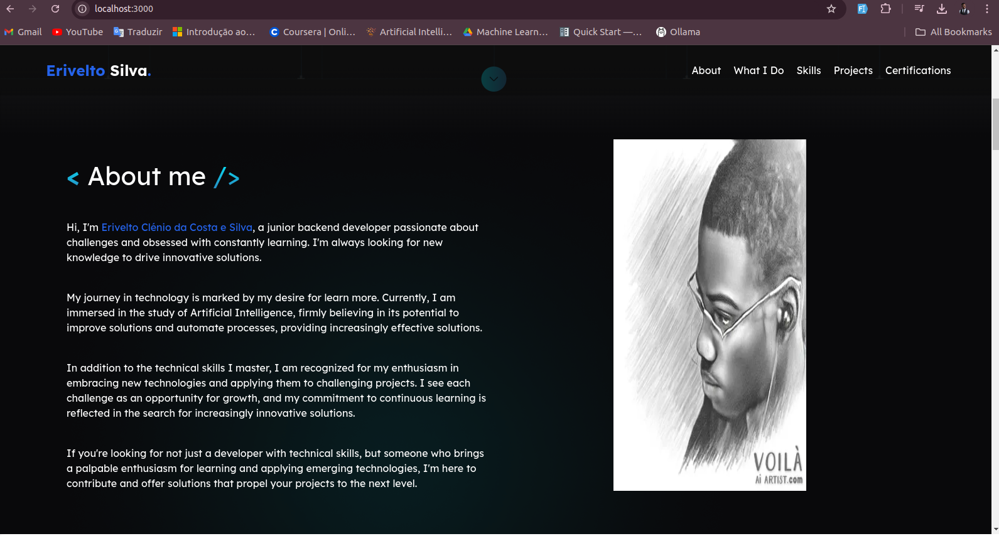
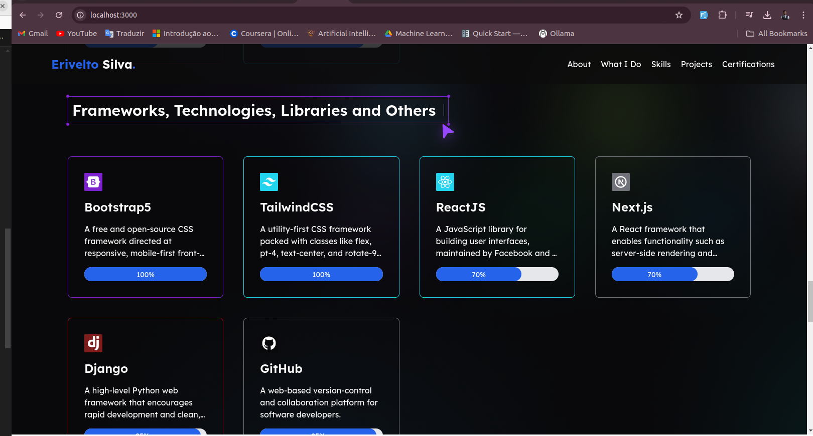
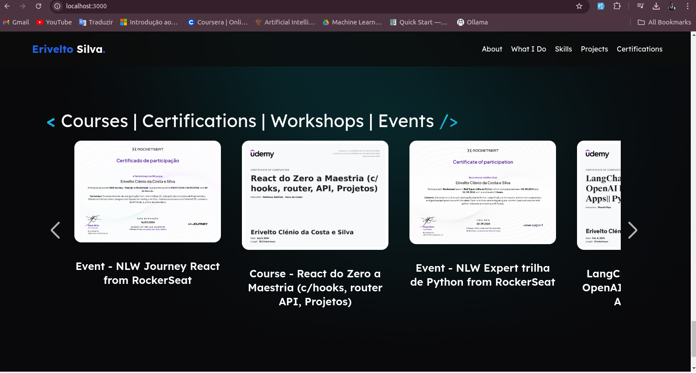

[TYPESCRIPT__BADGE]: https://img.shields.io/badge/typescript-D4FAFF?style=for-the-badge&logo=typescript
[TailwindCSS_BADGE]: https://img.shields.io/badge/tailwindcss-%2338B2AC.svg?style=for-the-badge&logo=tailwind-css&logoColor=white
[NEXT_BADGE]: https://img.shields.io/badge/Next-black?style=for-the-badge&logo=next.js&logoColor=white
[PROJECT__BADGE]: https://img.shields.io/badge/📱Visit_this_project-000?style=for-the-badge&logo=project
[PROJECT__URL]: https://portfolio-1f6u.vercel.app/
[REACT_HOOKS]: https://img.shields.io/badge/React%20Hook%20Form-%23EC5990.svg?style=for-the-badge&logo=reacthookform&logoColor=white
[VERCEL_BADGE]: https://img.shields.io/badge/vercel-%23000000.svg?style=for-the-badge&logo=vercel&logoColor=white


<h1 align="center" style="font-weight: bold;">Portfloio Dev  💻</h1>

![next][NEXT_BADGE]
![React Hooks][REACT_HOOKS]
![typescript][TYPESCRIPT__BADGE]
![TailwindCss][TailwindCSS_BADGE]
![Vercel][VERCEL_BADGE]


`Content:`
<p align="center">
 <a href="#about">About</a>  • 
 <a href="#started">Getting Started</a> • 
 <a href="#prerequisites">Prerequisites</a> • 
 <a href="#howToRun">How To CLone & Run</a> • 
 <a href="#results">Results</a>  • 
 <a href="#contribute">Contributes</a>  • 
 <a href="#collaborators">Collaborators</a> • 
 <a href="#license">License</a> • 
</p>


<p align="center">
    
</p>

<h2 id="started">📌 About</h2>

This is my developer portfolio, created with Next.js and TypeScript, and deployed on Vercel. This project showcases my skills and experience in web development, UI design, and the use of modern technologies.

[![project][PROJECT__BADGE]][PROJECT__URL]


<h2 id="started">🚀 Getting started</h2>

This section describes how to run the project locally.

<h3 id="prerequisites">Pre-requisites</h3>

Here you list all prerequisites necessary for running your project. For example:

- NodeJS
- npm
- TypeScript
- Git 

<h2 id="howToRun">🔗 How to Clone & Run</h2>

<h3>Cloning</h3>

- Clone the project repository from GitHub:

```bash
git clone https://github.com/EriveltoSilva/portfolio
```
or in linux:
```bash
git clone git@github.com:EriveltoSilva/portfolio.git
```

<h3>Running</h3>

- Navigate to the project directory:

```bash
cd portfolio
```

- Install the required dependencies:
```bash
npm install
```

- Run the project:
```bash
npm run dev
```

<h2 id="results">🤝 Results</h2>

<p align="center">
    
    
    
    
</p>

<h2 id="contribute">📫 Contribute</h2>

To contribute to this project, follow these steps:

1. `git clone https://github.com/EriveltoSilva/portfolio`
2. `git checkout -b feature/NAME`
3. Follow commit patterns
4. Open a Pull Request explaining the problem solved or feature made. If applicable, include screenshots of visual modifications and wait for the review!


<h2 id="collaborators">🤝 Collaborators</h2>

Special thank you for all people that contributed for this project.

<table>
  <tr>
    <td align="center">
      <a href="#">
        <br>
        <sub>
          <b>Erivelto Silva</b>
        </sub>
      </a>
    </td>
  </tr>
</table>


<h2 id="license">License</h2>

This project is licensed under the <a href="./LICENSE">MIT License</a>. See the LICENSE file for more information.